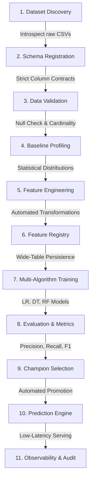

<div align="center">

# FeatureFlow
### Enterprise-Grade MLOps & Feature Store Platform

**v1.0.0 — Gold Release**

[](https://www.python.org/downloads/)
[](https://fastapi.tiangolo.com/)
[](https://www.postgresql.org/)
[](https://redis.io/)
[](https://mlflow.org/)
[](https://www.docker.com/)
[](LICENSE)
[](.github/workflows/ci.yml)

</div>

---

## Overview

**FeatureFlow** is a production-grade MLOps platform that unifies feature management, model training, real-time inference, and observability into a single, coherent system. It is engineered to eliminate **training-serving skew** and provide a deterministic, auditable, and scalable ML lifecycle.

This repository represents the **v1.0.0 Gold Release** — a fully certified production architecture built on an async PostgreSQL backend, Redis caching, MLflow experiment tracking, Prometheus/Grafana observability, and enterprise-grade security.

---

## Key Features

| Feature | Description |
|---|---|
| 🗄️ **Feature Store** | Centralized offline and online feature registry with Redis sub-millisecond serving |
| 🤖 **Multi-Algorithm Training** | Logistic Regression, Decision Tree, and Random Forest via a unified training pipeline |
| 🏆 **Champion/Challenger** | Automated champion model selection with alias-based MLflow promotion |
| ⚡ **Real-Time Inference** | Low-latency prediction engine with Redis caching and PostgreSQL fallback |
| 🧠 **Explainability** | SHAP-powered per-prediction feature importance, asynchronously generated |
| 📊 **Data Quality** | Schema validation, profiling, and drift detection via Evidently AI |
| 📈 **Observability** | Prometheus metrics, Grafana dashboards, and audit logging |
| 🔒 **Security** | JWT authentication, API keys, bcrypt password hashing, RBAC |
| 🏗️ **Production Ready** | Multi-stage Docker, Alembic migrations, CI/CD, health probes |

---

## Architecture

FeatureFlow processes datasets through an **11-Stage Production Pipeline**:


```mermaid
graph TD
    A[1. Dataset Discovery] -->|Introspect raw CSVs| B[2. Schema Registration]
    B -->|Strict Column Contracts| C[3. Data Validation]
    C -->|Null Check & Cardinality| D[4. Baseline Profiling]
    D -->|Statistical Distributions| E[5. Feature Engineering]
    E -->|Automated Transformations| F[6. Feature Registry]
    F -->|Wide-Table Persistence| G[7. Multi-Algorithm Training]
    G -->|LR, DT, RF Models| H[8. Evaluation & Metrics]
    H -->|Precision, Recall, F1| I[9. Champion Selection]
    I -->|Automated Promotion| J[10. Prediction Engine]
    J -->|Low-Latency Serving| K[11. Observability & Audit]
```

**System Architecture:**

```
Client → FastAPI Gateway → JWT Auth → Router
                                        ├── Feature Registry → PostgreSQL
                                        ├── Training Engine  → MLflow
                                        ├── Inference Engine → Redis / PostgreSQL
                                        ├── Monitoring       → Evidently AI
                                        └── /metrics         → Prometheus → Grafana
```

---

## Technology Stack

| Layer | Technology |
|---|---|
| **API** | FastAPI 0.115+, Pydantic v2, Uvicorn |
| **Database** | PostgreSQL 15+, SQLAlchemy 2.0 Async, asyncpg |
| **Cache / Online Store** | Redis 7.0+, aioredis |
| **ML & Training** | Scikit-Learn, Pandas, NumPy, Joblib |
| **Experiment Tracking** | MLflow 2.x (PostgreSQL backend) |
| **Explainability** | SHAP |
| **Data Quality** | Great Expectations, Evidently AI |
| **Observability** | Prometheus, Grafana |
| **Security** | PyJWT, bcrypt, python-dotenv |
| **Infrastructure** | Docker, Docker Compose, Alembic, GitHub Actions |

---

## Documentation

| Document | Description |
|---|---|
| [docs/ARCHITECTURE.md](docs/ARCHITECTURE.md) | System design, component interactions, data flow |
| [docs/API.md](docs/API.md) | Full API reference with examples |
| [docs/DEPLOYMENT.md](docs/DEPLOYMENT.md) | Docker, production, and cloud deployment guide |
| [docs/OBSERVABILITY.md](docs/OBSERVABILITY.md) | Prometheus metrics, Grafana dashboards, alerting |
| [docs/RELEASE_CHECKLIST.md](docs/RELEASE_CHECKLIST.md) | Pre-deployment production checklist |
| [docs/CONTRIBUTING.md](docs/CONTRIBUTING.md) | Contribution guide |
| [docs/BACKUP_RECOVERY.md](docs/BACKUP_RECOVERY.md) | Backup and disaster recovery procedures |
| [CHANGELOG.md](CHANGELOG.md) | Release history |

---

## Directory Structure

```text
FeatureFlow/
├── app/
│   ├── cache/           # Redis client, online store, model/prediction caching
│   ├── config.py        # Centralized environment configuration
│   ├── data/            # Dataset discovery, loaders, validation, profiling
│   ├── data_quality/    # Data contract validation and drift gates
│   ├── explainability/  # SHAP-based feature importance engine
│   ├── features/        # Feature engineering, transformers, registry
│   ├── inference/       # Prediction engine, traffic routing, fallbacks
│   ├── mlflow/          # MLflow service layer and model registry integration
│   ├── monitoring/      # Audit logging and drift detection (Evidently AI)
│   ├── observability/   # Prometheus metrics, instrumentation, middleware
│   ├── pipelines/       # End-to-end ML pipeline orchestration
│   ├── security/        # JWT, API keys, RBAC, middleware
│   ├── serving/         # FastAPI app, routers, endpoints, health probes
│   ├── storage/         # SQLAlchemy models, database, repositories
│   ├── training/        # Multi-algorithm trainers, evaluators, artifact store
│   └── utils/           # Structured logging, utilities
├── alembic/             # Database schema migrations (Alembic async)
├── docs/                # All project documentation
├── grafana/             # Grafana dashboard provisioning
├── prometheus/          # Prometheus scrape configuration
├── scripts/             # Production certification runner
├── tests/               # Unit, integration, and performance test suites
├── .github/workflows/   # CI/CD pipelines (ci.yml, docker.yml, release.yml)
├── Dockerfile           # Multi-stage production container
├── Dockerfile.dev       # Development container with hot reload
├── docker-compose.yml   # Development stack orchestration
├── docker-compose.prod.yml # Production stack with resource limits
├── alembic.ini          # Alembic migration configuration
└── requirements.txt     # Pinned Python dependencies
```

---

## Quick Start

### Prerequisites
- Python 3.12+
- PostgreSQL 15+ (or Docker)
- Redis 7.0+ (or Docker)
- Git

### Local Development (without Docker)

```bash
# 1. Clone the repository
git clone https://github.com/shanmukha1013/FeatureFlow.git
cd FeatureFlow

# 2. Create and activate virtual environment
python -m venv venv
source venv/bin/activate  # Windows: .\venv\Scripts\Activate.ps1

# 3. Install dependencies
pip install -r requirements.txt

# 4. Configure environment
cp .env.development .env
# Edit .env with your PostgreSQL and Redis credentials

# 5. Start the server
uvicorn app.serving.main:app --host 0.0.0.0 --port 8000 --reload
```

Visit:
- **Swagger UI**: http://localhost:8000/docs
- **ReDoc**: http://localhost:8000/redoc
- **Health Check**: http://localhost:8000/health

### Docker Development Stack

```bash
cp .env.development .env
docker compose up --build
```

### Production Deployment

```bash
# Configure production environment
cp .env.production .env
# Fill in real credentials in .env

docker compose -f docker-compose.prod.yml --env-file .env up -d --build
```

See [docs/DEPLOYMENT.md](docs/DEPLOYMENT.md) for cloud deployment instructions.

---

## Database Migrations

FeatureFlow uses Alembic for production-safe schema migrations:

```bash
# Apply all pending migrations
alembic upgrade head

# Create a new migration after model changes
alembic revision --autogenerate -m "describe_change"

# Rollback last migration
alembic downgrade -1
```

---

## Testing & Certification

```bash
# Run full test suite (78 tests: unit, integration, performance)
pytest tests/ -v

# Static code analysis
flake8 app tests scripts

# Production certification (100/100 required)
python scripts/certify_production.py
```

**Expected output:**
```
================== 78 passed, 5 warnings ==================

Enterprise Certification Score: 100 / 100
```

---

## Health & Observability Endpoints

| Endpoint | Description |
|---|---|
| `GET /live` | Liveness probe — process is alive |
| `GET /ready` | Readiness probe — all dependencies healthy |
| `GET /health` | Full component health check |
| `GET /metrics` | Prometheus metrics scrape endpoint |
| `GET /docs` | Interactive Swagger UI |

---

## Roadmap (v1.1+)

- [ ] Feature serving via gRPC for ultra-low latency
- [ ] S3/MinIO artifact store for multi-replica deployments
- [ ] A/B testing framework for champion/challenger routing
- [ ] Kubernetes Helm chart
- [ ] Real-time streaming feature ingestion (Kafka)

---

## License

FeatureFlow is released under the [MIT License](LICENSE).

---

## Connect

**Portfolio**: https://shanmukha-portfolio-six.vercel.app  
**LinkedIn**: https://linkedin.com/in/marellashanmukhareddy

---

<div align="center">

**From Ideas to Products.**

*FeatureFlow v1.0.0 — Enterprise ML Platform*

</div>
