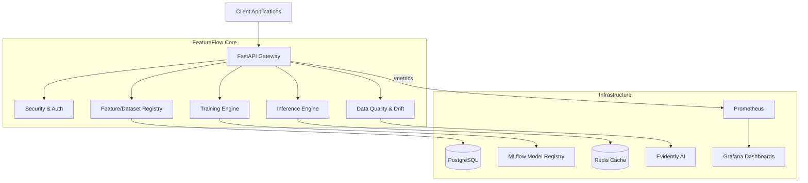

# FeatureFlow Architecture

FeatureFlow is a portfolio-quality MLOps platform built for modern machine learning workflows. It provides a robust, end-to-end foundation for dataset management, model training, feature serving, data drift monitoring, and observability.

This document provides a comprehensive overview of the system architecture, component interactions, and data flow.

## 1. Overall System Architecture

The platform follows a modular, microservices-oriented monolithic design built on FastAPI. It separates concerns across data registries, offline/online stores, ML training, explainability, and observability. 



## 2. Request Flow

1. **Authentication**: All API requests pass through the FastAPI dependency injection layer (`get_current_user`), validating JWTs or API keys against Redis (for revocation checks) and PostgreSQL.
2. **Routing**: The FastAPI routers (`app/serving/api/v1/router.py`) dispatch requests to specific service classes.
3. **Service Layer**: Business logic executes in the service layer, coordinating between PostgreSQL (metadata), Redis (cache), and MLflow (artifacts).
4. **Response**: Data is serialized via Pydantic schemas and returned to the client, while background tasks handle heavy lifting (like metrics collection or dataset parsing).

## 3. Data Flow & ML Lifecycle

The machine learning lifecycle in FeatureFlow is fully integrated from data ingestion to production serving:

1. **Ingestion**: Datasets are uploaded and registered. Metadata is stored in Postgres.
2. **Validation**: Data quality gates (via Great Expectations) validate schemas.
3. **Training**: The `Trainer` module triggers model training on validated datasets.
4. **Experiment Tracking**: Training metrics, hyperparameters, and artifacts are logged directly to MLflow.
5. **Promotion**: Champion models are tagged in MLflow using Aliases (e.g., `champion`, `production`).
6. **Inference**: The `PredictionEngine` fetches the champion model from MLflow (or Redis cache) and runs predictions.
7. **Monitoring**: Evidently AI continuously evaluates incoming prediction batches against reference datasets to detect data drift.

## 4. Component Interaction

FeatureFlow emphasizes loose coupling. The Core Services depend on abstractions rather than concrete infrastructure implementations.

- **Storage Layer**: Uses SQLAlchemy with asynchronous `asyncpg` drivers for non-blocking I/O.
- **Cache Layer**: Implements a generic `CacheManager` allowing caching of string/JSON data, models, and predictions with fallback mechanisms.
- **Observability Layer**: Exposes middleware to track latency and background tasks to track system resources.

## 5. PostgreSQL Schema Overview

The PostgreSQL database acts as the single source of truth for all platform metadata (excluding MLflow artifacts).

- `users`, `roles`, `permissions`: RBAC and authentication.
- `api_keys`: Long-lived programmatic access tokens.
- `datasets`, `dataset_versions`: Feature engineering and dataset lineage.
- `features`, `feature_groups`: Online and offline feature definitions.
- `models`, `model_versions`: Lightweight MLflow references and metadata.
- `monitoring_reports`: Evidently AI drift analysis histories.

*(Note: MLflow maintains its own isolated schema `mlflow` inside the same PostgreSQL instance to track experiments and runs).*

## 6. Redis Architecture

Redis serves multiple critical roles to ensure low-latency serving:

1. **Online Feature Store**: Caches real-time feature vectors for sub-millisecond inference.
2. **Prediction Cache**: Caches model outputs for duplicate requests to save compute.
3. **Model Cache**: Caches MLflow serialized models in-memory to prevent cold starts during traffic spikes.
4. **Auth Revocation**: Fast lookups for revoked JWT tokens.

FeatureFlow implements an enterprise-grade `RedisClient` with automatic retries, connection pooling, and circuit breaking capabilities.

## 7. MLflow Architecture

MLflow is integrated as the artifact and experiment backend. 
- **Backend Store**: Configured to use a dedicated PostgreSQL schema (`-c search_path=mlflow`).
- **Artifact Store**: Local filesystem (extensible to S3/MinIO for cloud deployments).
- **Integration**: FeatureFlow interacts with MLflow via the `MlflowClient`, utilizing Aliases to promote models through their lifecycle instead of rigid stages.

## 8. Observability Architecture

Observability is a first-class citizen in FeatureFlow, designed for zero performance penalty.

- **Metrics Collection**: Custom Prometheus metrics (`featureflow_*`) are updated via lightweight instrumentation decorators and middleware.
- **System Metrics**: `psutil` runs in an asynchronous background loop within the FastAPI lifespan.
- **Dashboards**: Grafana provisions dashboards dynamically upon startup via `grafana/provisioning`.

## 9. Deployment Architecture

FeatureFlow is designed to be deployed as a containerized stack.

```yaml
version: '3.8'
services:
  web: # FastAPI Application
  postgres: # Relational Metadata
  redis: # Cache & Online Store
  mlflow: # Model Registry
  prometheus: # Metrics Scraper
  grafana: # Dashboards
```

All services are orchestrated via Docker Compose, making the platform easily portable to Kubernetes or managed cloud services like AWS ECS or GCP Cloud Run.
