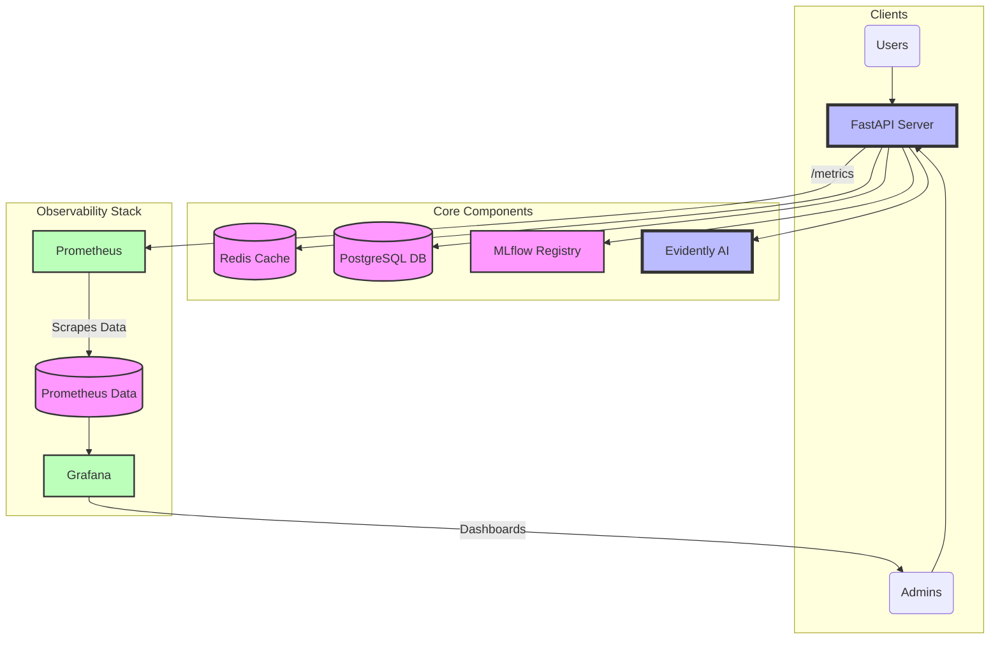

# FeatureFlow Observability & Monitoring

FeatureFlow integrates a full observability stack utilizing Prometheus and Grafana for metrics collection, alerting, and dashboarding. This guarantees production visibility and allows seamless tracking of performance, API usage, cache health, and data drift.

## Architecture Diagram



## Configuration

- Prometheus configuration and alert rules are located in `./prometheus/`.
- Grafana provisioning (datasources and dashboards) is located in `./grafana/provisioning/`.

### Securing Metrics
By default, `/metrics` is exposed without authentication to facilitate development.
To secure this endpoint in production, set the following environment variable:
```bash
ENABLE_METRICS_AUTH=true
```
When enabled, requests to `/metrics` require a valid JWT token via the `Authorization` header.

## Available Dashboards
1. **Platform Overview**: High-level system health, active models, drift status.
2. **System Overview**: CPU, memory, HTTP request rates, errors.
3. **API Dashboard**: Endpoint latency (P95/P99), request volume, active requests.
4. **ML Dashboard**: Prediction throughput, training durations, model registrations.
5. **Data Quality**: Data drift detections and checks executed.
6. **Infrastructure**: Cache hit rates, Redis/Postgres health.

## Core Metrics Catalogue
All metrics are prefixed with `featureflow_`.

| Metric Name | Type | Description |
|---|---|---|
| `featureflow_http_requests_total` | Counter | Total HTTP requests (labels: `method`, `endpoint`, `status`) |
| `featureflow_http_request_duration_seconds` | Histogram | API latency distribution |
| `featureflow_http_requests_active` | Gauge | Number of active requests |
| `featureflow_prediction_requests_total` | Counter | Prediction volume (labels: `model_name`) |
| `featureflow_prediction_latency_seconds` | Histogram | Inference latency per model |
| `featureflow_training_runs_total` | Counter | Number of training runs (labels: `algorithm`) |
| `featureflow_training_duration_seconds` | Histogram | Duration of ML training runs |
| `featureflow_drift_detected_total` | Counter | Total drift events detected by Evidently AI |
| `featureflow_cache_hits_total` | Counter | Cache hits (labels: `cache_type`) |
| `featureflow_cache_misses_total` | Counter | Cache misses (labels: `cache_type`) |
| `featureflow_process_memory_bytes` | Gauge | Application memory usage |
| `featureflow_process_cpu_percent` | Gauge | CPU percentage utilized by the API |

## Alert Rules
Prometheus is configured with alerts for critical failures, which include:
- **High API Latency**: API latency P95 > 1s for sustained 5m.
- **High Error Rate**: 5xx Error Rate > 5% within 1m.
- **Prediction Failures**: Model failure spikes.
- **Cache Hit Rate Low**: Cache hit rate dropping below 50%.
- **Drift Detected**: When drift is triggered for active features.
- **Infrastructure Down**: If Redis, Postgres, or MLflow goes offline.

Alerts can be easily routed to Alertmanager for downstream dispatch to Slack, PagerDuty, or email integrations.

## Adding New Metrics
To add a new metric:
1. Define the metric object (Counter, Gauge, Histogram, Summary) in `app/observability/metrics.py`.
2. Prefix the metric with `featureflow_` to maintain consistency.
3. Add a helper recording function to `app/observability/instrumentation.py`.
4. Import and call the helper function inside your target service method.

## Troubleshooting
- **Dashboard Empty**: Ensure the FastAPI server is running and the `/metrics` endpoint is accessible. Verify Prometheus is able to reach the target defined in `prometheus.yml`.
- **Metrics Unauthorized**: If you receive a `401 Unauthorized` hitting `/metrics`, ensure you are passing a valid Bearer token, or set `ENABLE_METRICS_AUTH=false` for local testing.
- **Grafana Login**: Default Grafana credentials are `admin` / `admin`.

## Production Deployment Notes
- Ensure Docker volume mounts for `prometheus_data` and `grafana_data` are backed up regularly.
- Protect the `/metrics` endpoint using `ENABLE_METRICS_AUTH=true`.
- Adjust `scrape_interval` in `prometheus.yml` (default is 10s) based on your scaling requirements.
